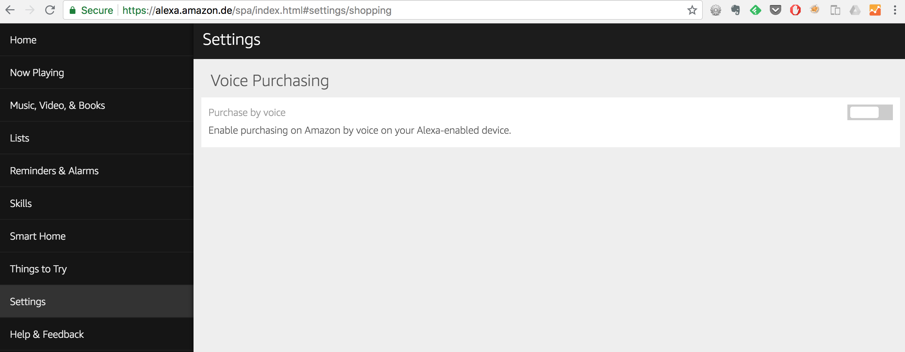
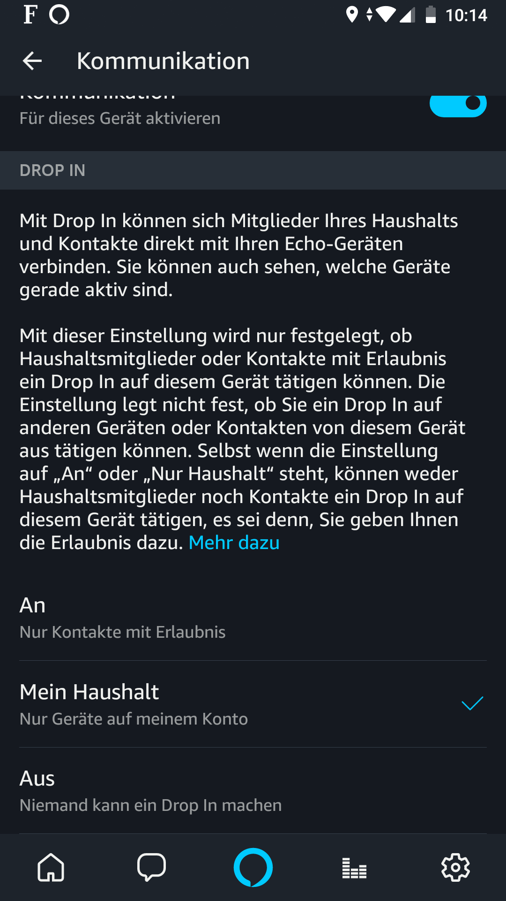

Amazon Alexa is a realy cool device. I use it for the following tasks: 
First of all for listening to music. Remembering the days of last.fm, 
Alexa is perfect for listening to music by artist or genre while cooking, 
cleaning up or as a play along - assuming you play an instrument. 
But and that's a big but Alexa lacks some security features. First of all 
there is absolutely no authentication to the best of my knowledge. If I am wrong, 
please contact me. Considering usability aspects this makes sense. You want 
your voice assistant to work as smooth as possible. For playing music, 
checking the weather forecast or traffic you do not need such a thing. 
However as soon as you allow shopping it becomes interesting from an 
attackers point of view. Amazon thought of this aspect and gave you an 
option to limit the shopping experience to denying access to the checkout. 
Clearly one could fill up your basket but not actually purchase anything.

Managing lists is an other feature that I use quiet heavily. Seriously this 
is one of the most insecure features since Alexa doesn't offer any 
authentication everyone can easily check your lists as soon as he or she 
has physical access to your Alexa. The only thing you can do here is to 
keep the items of your list as simple and harmless as possible. 
However this is easier said than done 😂.

Communications is an exceptional feature once you have more than one Alexa 
in your home. You may remember the news articles about a conversation recorded 
and send to a friend without the victim's notice ([ Link ](https://www.businessinsider.de/amazon-alexa-records-private-conversation-2018-5?r=US&IR=T)). 
Assuming that this story is true, you need to keep in mind that Alexa can do 
this - but you need to authorize two steps to get the recording send to one 
of your upfront activated contacts. To put it simply: you can't erroneously 
send messages/recordings to anybody. There are some steps to take actively. 
The nice thing is you can configure different security levels. For example 
it is possible to restrict the communications to the Alexa devices you/your 
household owns. So it is simply a house telephone. Great feature - my family 
loves it and uses it heavily. Just make sure you have the appropriate configuration 
activated.

 

Of course you may abuse this feature to spy on your kids for example. Which is
not as simple as thought because the LED ring on the top of the device turns
green when "drop in" is active and sounds from your location are replayed on 
the device in high volume. So it makes a lot of noise. Still it is fun, especially
during holidays just to listen what is happening in an empty home 😂.

You see - it is great fun playing around with Alexa.

Enjoy and think twice before you do something with voice assistance.

Cheers !!
